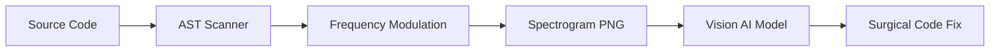

# Sonic Code Sentinel (sonic-boom)

[](https://bun.sh)
[](https://www.typescriptlang.org/)
[](https://modelcontextprotocol.io/)

**Sonic Code Sentinel** is a revolutionary Multimodal Code Diagnostic tool that bypasses LLM token limits by encoding massive TypeScript/JavaScript codebases into high-density **Audio Spectrogram PNGs**. 

Instead of reading raw text, this system allows Vision-capable AI models (like Gemini 1.5 Pro) to diagnose system errors, architectural debt, and "auditory anomalies" by interpreting the visual patterns of code logic.

---

## 🎵 The "Sonic Code" Paradigm

The codebase is mapped onto a 2D frequency spectrum where the spatial distribution of "sound" represents the structural integrity of the code.



### 🗺️ Coordinate Mapping
- **X-Axis (Time)**: The temporal sequence of the codebase. Each file occupies a discrete "Time Slot" separated by silent frames.
- **Y-Axis (Frequency)**: Partitioned into **Holographic Layers** (20Hz – 20kHz).
- **Amplitude (Brightness)**: Represents nesting depth and cyclomatic complexity. High brightness = High complexity.

### 🌈 Holographic Layers
| Frequency Range | Layer Name | Content Types |
| :--- | :--- | :--- |
| **20Hz - 8kHz** | `LOGIC` | Core logic (`.ts`, `.tsx`, `.js`, `.jsx`) |
| **8kHz - 12kHz** | `STYLES` | Styling assets (`.css`, `.scss`, `.less`) |
| **12kHz - 16kHz** | `MARKUP` | Structural assets (`.svg`, `.html`, `.md`) |
| **16kHz - 20kHz** | `ANOMALY` | **The Anomaly Zone** (Bugs, `any` types, Circular deps) |

---

## 🚨 Visual Anomalies

AI models are trained to identify specific visual "textures" that indicate poor code health:

- **The Shriek (Magenta Spike)**: A sharp vertical line in the 16kHz+ zone. Indicates a high-risk `any` type, unhandled exception, or an `unknown` node.
- **The Growl (Red Gradient)**: A wide, bright red smear. Indicates a **"Complexity Growl"**—functions where cyclomatic complexity or nesting depth exceeds threshold (> 5).
- **Silent Frames**: Black vertical lines that act as boundaries between files, ensuring no frequency bleeding.

---

## 🛠️ MCP Tools (The Surgical Strike)

Sonic Code Sentinel includes a built-in **Model Context Protocol (MCP)** server, enabling AI agents to interact with the spectrogram programmatically.

| Tool Name | Purpose |
| :--- | :--- |
| `get_project_spectrogram` | **Initial Scan**. Generates the PNG and mapping table. |
| `resolve_sonic_coordinates` | **Translation**. Converts (X, Y) pixel coordinates into File/Line numbers. |
| `get_code_snippet` | **Extraction**. Fetches a 20-line context window for the resolved location. |

### 🎯 The Workflow
1. **Visualize**: Agent generates a spectrogram of the entire repo.
2. **Identify**: Vision model spots a "Magenta Shriek" at `(1024, 850)`.
3. **Resolve**: Agent calls `resolve_sonic_coordinates(x=1024, y=850)`.
4. **Fix**: Agent fetches the code via `get_code_snippet` and applies a patch.

---

## 🚀 Getting Started

### Prerequisites
- [Bun](https://bun.sh) (v1.1+ recommended)

### Installation
```bash
bun install
```

### Running as a CLI
Analyze any local directory and generate a diagnostic spectrogram:

```bash
# Analyze a project
bun run src/index.ts ../path/to/project

# Exclude specific patterns
bun run src/index.ts ../path/to/project --exclude "**/tests/**"
```

### Running as an MCP Server
To use with Claude Desktop or other MCP clients, add this to your config:

```json
{
  "mcpServers": {
    "sonic-boom": {
      "command": "npx",
      "args": [
        "-y",
        "sonic-boom-mcp@latest"
      ]
    }
  }
}
```

### Inspecting MCP Server
To inspect the MCP server locally run this command:

```bash
bun x npx @modelcontextprotocol/inspector bun run src/mcp-server.ts
```

---

## 📂 Output
The tool generates a diagnostic bundle in the `./output` directory:
- **`spectrogram.png`**: The high-density visual map.
- **`mapping_table.json`**: Metadata used by the `resolver` to map pixels to code.

**Sonic Code Sentinel** — *Hear the code. See the bugs.*

---

## 📄 License
This project is licensed under the **PolyForm Noncommercial License 1.0.0**. 

- **Free for Personal/Non-commercial use**: You are free to use, modify, and distribute this software for personal projects, research, and hobbyist pursuits.
- **Commercial Use**: Any use for profit-seeking purposes requires a separate commercial license. Please contact the author for details.


