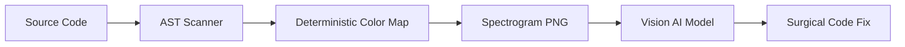

# Sonic Code Sentinel (sonic-boom)

[](https://bun.sh)
[](https://www.typescriptlang.org/)
[](https://modelcontextprotocol.io/)

**Sonic Code Sentinel** encodes an entire TypeScript / JavaScript codebase into a single PNG **heatmap** that vision-capable AI models can read in one glance — bypassing token limits for codebase-scale audits.

The image is a *deterministic function of the AST*: same code → byte-identical pixels. Each pixel encodes a category (via color) and severity (via brightness), so the picture itself is the audit summary — no separate lookup required.

---

## 🎵 The Spectrogram

The codebase is laid out as a 2D heatmap.



### 🗺️ Coordinate Mapping
- **X-Axis**: Each file occupies a contiguous horizontal slot. Within a slot, X is proportional to the line number of the node.
- **Y-Axis**: Partitioned into four bands (see below). Within the top `ANOMALY` band, each Y-row is reserved for one concern — turning the band into a row-per-category heatmap.
- **Color**: Encodes the anomaly category (see catalog below).
- **Brightness (Amplitude)**: Encodes severity — `high` is brightest (1.0), `med` is mid (0.75), `low` is dim (0.5). Structural (non-anomaly) pixels fade with nesting depth.

### 🌈 Frequency Bands
| Hz Range | Layer | Content |
| :--- | :--- | :--- |
| 20 – 8 k | `LOGIC` | Source files (`.ts`, `.tsx`, `.js`, `.jsx`) |
| 8 k – 12 k | `STYLES` | Stylesheets (`.css`, `.scss`, `.less`) |
| 12 k – 16 k | `MARKUP` | Markup assets (`.svg`, `.html`, `.md`) |
| 16 k – 20 k | `ANOMALY` | Per-category rows for detected concerns |

---

## 🔬 Detected Anomalies

13 categories. Each has a stable Hz row, a stable color, and a fixed severity — so the heatmap is readable without consulting the mapping table.

| Category | Severity | Detection |
| :--- | :--- | :--- |
| Empty catch block | **high** | `catch (e) {}` with empty body |
| Layer Violation | **high** | File under `/components/` importing from `/pages/` |
| Massive Component | **high** | `.tsx` / `.jsx` with > 250 lines |
| Prop Overload | **high** | Interface ending in `Props` with > 7 members (count surfaced in label) |
| Explicit `: any` type | med | Parameter, variable, or property typed `any` |
| Heavy Library Import | med | Imports `moment`, `lodash`, or `jquery` (name surfaced in label) |
| High Complexity | med (high if cc ≥ 20) | Function / method / arrow / class with cyclomatic > 5 or depth > 5 — label includes `cc=N, depth=N` |
| Heavy Barrel Export | med | `index.ts` / `index.js` with > 10 exports |
| Commented-out Code Block | med | Long comment block containing code-like characters |
| Z-Index Escalation | med | `z-[N]` or `z-N` where N > 1000 |
| Unresolved TODO/FIXME | med | Leading comment matching `/TODO|FIXME/i` |
| Tailwind Magic Value | low | Arbitrary `-[value]` Tailwind class outside `var(...)` |
| Missing Test File | low | Source file with no sibling `*.test.*` or `*.spec.*` |

### 🎨 Color Legend
| Color | Category |
| :--- | :--- |
| White | Layer Violation |
| Bright Red | Empty catch block |
| Light Red | Explicit `: any` type |
| Purple | Heavy Library Import |
| Orange | Prop Overload |
| Amber | High Complexity (with 5-px horizontal spread for emphasis) |
| Gold | Massive Component |
| Dim Yellow | Heavy Barrel Export |
| Sky Blue | Z-Index Escalation |
| Cyan | Tailwind Magic Value |
| Bright Yellow | Unresolved TODO/FIXME |
| Grey | Commented-out Code Block |
| Dim Blue-Grey | Missing Test File |

Below the `ANOMALY` band, structural pixels render green / blue / orange for the `LOGIC` / `STYLES` / `MARKUP` layers respectively.

---

## 🛠️ MCP Tools

Three tools, used as a pipeline.

| Tool | Purpose |
| :--- | :--- |
| `get_project_spectrogram` | Generates the PNG + mapping table. Returns the PNG (base64), a severity-sorted top-10 anomaly summary, and the color legend. |
| `resolve_sonic_coordinates` | Translates `(x, y)` pixel coordinates into `{ file, line, type, category?, severity?, proximityMatch?, pixelDistance?, context }`. |
| `get_code_snippet` | Fetches a 20-line context window for a given file + line. |

### Resolution behavior
- **Strict snap**: clicks within 12 px of an anomaly pixel resolve to that anomaly, including its canonical category and severity.
- **Proximity fallback**: a click that lands far from every anomaly in a non-empty file slot still resolves — to the *closest* in-slot anomaly, flagged with `proximityMatch: true` and a `pixelDistance` in pixels. Replaces the old "Could not resolve coordinates" dead end.

### Workflow
1. **Visualize**: agent calls `get_project_spectrogram` over the repo root.
2. **Read the heatmap**: the vision model identifies a bright pixel cluster by color (e.g. amber row = High Complexity, white row = Layer Violation).
3. **Resolve**: `resolve_sonic_coordinates(x, y)` returns file, line, category, severity.
4. **Snippet**: `get_code_snippet` for the 20-line window.
5. **Fix**: apply patch.

---

## 🚀 Getting Started

### Prerequisites
- [Bun](https://bun.sh) v1.1+

### Install
```bash
bun install
```

### CLI
Generate a spectrogram for any local directory:
```bash
# Scan a project
bun run src/index.ts ../path/to/project

# Exclude additional patterns
bun run src/index.ts ../path/to/project --exclude "**/tests/**"

# Resolve coordinates from a previously generated mapping
bun run src/index.ts fix --coords 150,400 --issue "describe the issue"
```

Outputs land in `./output/`:
- `spectrogram.png` — the heatmap.
- `mapping_table.json` — per-pixel metadata used by the resolver (file, line, anomaly category, severity).

### MCP server
Add to your MCP client config (e.g. Claude Desktop):
```json
{
  "mcpServers": {
    "sonic-boom": {
      "command": "npx",
      "args": ["-y", "sonic-boom-mcp@latest"]
    }
  }
}
```

The MCP server stores its artifacts under `<tmp>/sonic-boom-mcp/`; tool calls pass `directoryPath` to identify the project root.

### Inspect MCP locally
```bash
bun x npx @modelcontextprotocol/inspector bun run src/mcp-server.ts
```

### Run tests
```bash
bun test
```
The suite covers ignore-file handling, every anomaly detection rule, scan determinism, and resolver round-trip behavior.

---

## 🧱 Design Properties

- **Deterministic**: same source → byte-identical PNG and mapping JSON across runs. No RNG anywhere in the scan or render pipeline.
- **Heatmap by construction**: color = category, brightness = severity, Y-row = concern. The image is the audit, not a decoration.
- **Ignore-file aware**: respects `.gitignore`, `.npmignore`, `.dockerignore`, `.sonicignore`, `.eslintignore`, `.prettierignore`, and `.gcloudignore` — both at the repo root and in any subdirectory. Built-in skip list: `node_modules`, `.git`, `dist`, `.next`, `out`, `build`, `.vscode`, `.idea`, `output`.

**Sonic Code Sentinel** — *Hear the code. See the bugs.*

---

## 📄 License
This project is licensed under the **PolyForm Noncommercial License 1.0.0**.

- **Free for personal / non-commercial use**: research, learning, hobby projects.
- **Commercial use** requires a separate commercial license — please contact the author for details.
